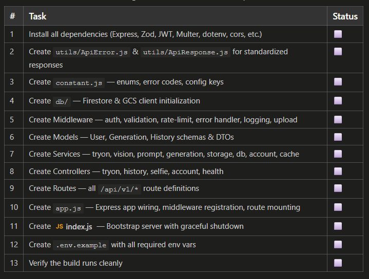
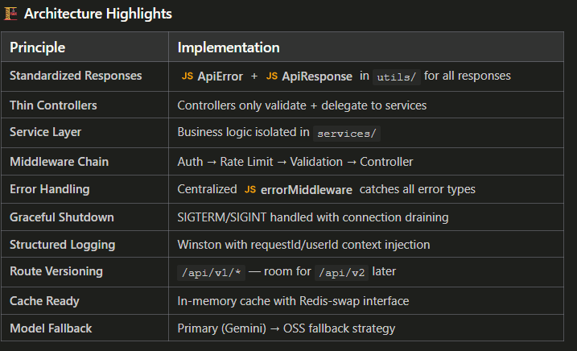
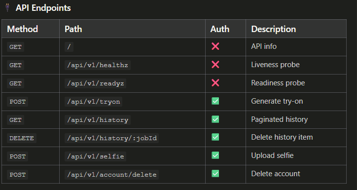

backend/
├── index.js                          # Server bootstrap (env, init, graceful shutdown)
├── package.json                      # Dependencies & scripts
├── .env                              # Local dev environment
├── .env.example                      # Template with all config keys
├── .gitignore
└── src/
    ├── app.js                        # Express wiring (middleware + routes)
    ├── constant.js                   # Error codes, limits, enums, configs
    ├── controllers/
    │   ├── tryon.controller.js       # POST /api/v1/tryon
    │   ├── history.controller.js     # GET/DELETE /api/v1/history
    │   ├── selfie.controller.js      # POST /api/v1/selfie
    │   ├── account.controller.js     # POST /api/v1/account/delete
    │   └── health.controller.js      # GET healthz/readyz
    ├── db/
    │   ├── firebase.js               # Firestore client (lazy singleton)
    │   ├── storage.js                # GCS client (lazy singleton)
    │   └── index.js                  # Barrel export
    ├── middleware/
    │   ├── auth.middleware.js         # JWT verification
    │   ├── validate.middleware.js     # Zod schema validation factory
    │   ├── rateLimit.middleware.js    # Per-IP + per-user rate limiters
    │   ├── error.middleware.js        # Centralized error → JSON handler
    │   ├── logging.middleware.js      # RequestId injection + structured logs
    │   └── upload.middleware.js       # Multer file upload (memory storage)
    ├── models/
    │   ├── schemas.js                # Zod validation schemas (all endpoints)
    │   └── models.js                 # Firestore doc creators + DTO converters
    ├── routes/
    │   ├── index.js                  # Barrel — mounts all route groups
    │   ├── tryon.routes.js
    │   ├── history.routes.js
    │   ├── selfie.routes.js
    │   ├── account.routes.js
    │   └── health.routes.js
    ├── services/
    │   ├── tryon.service.js          # Main orchestrator (full pipeline)
    │   ├── vision.service.js         # Garment + person image analysis
    │   ├── generation.service.js     # AI model invocation (primary + fallback)
    │   ├── storage.service.js        # GCS upload/download/delete
    │   ├── db.service.js             # Firestore CRUD operations
    │   ├── cache.service.js          # In-memory cache (Redis-ready)
    │   └── account.service.js        # Cascade account deletion
    └── utils/
        ├── ApiError.js               # ⭐ Standardized error class
        ├── ApiResponse.js            # ⭐ Standardized success response
        ├── asyncHandler.js           # Async error wrapper
        ├── logger.js                 # Winston structured logger
        ├── helpers.js                # Hashing, cursors, image validation
        └── promptBuilder.js          # AI prompt construction

🚀 Next Steps
The backend structure is complete and running. To make it production-ready, you'll need to:

Integrate Gemini API — Replace placeholders in 
generation.service.js
 and 
vision.service.js
 with actual API calls
Set up Firebase — Add service account credentials to 
.env
Create GCS bucket — Configure bucket names and CORS policies
Set up JWT issuing — Add auth flow (signup/login) or connect to Firebase Auth
